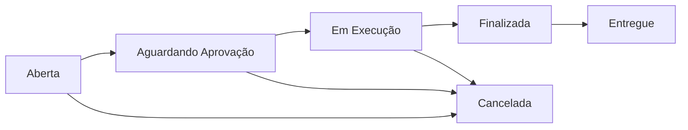
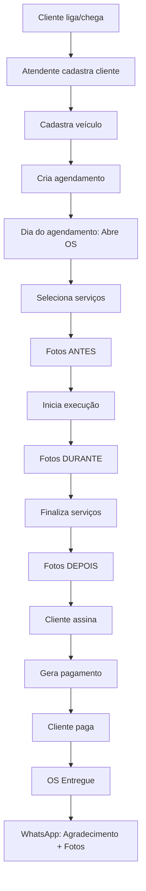
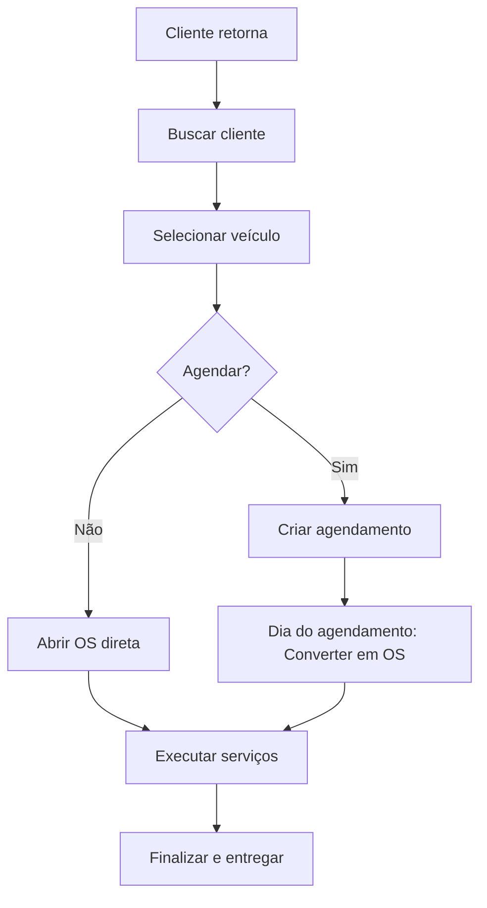
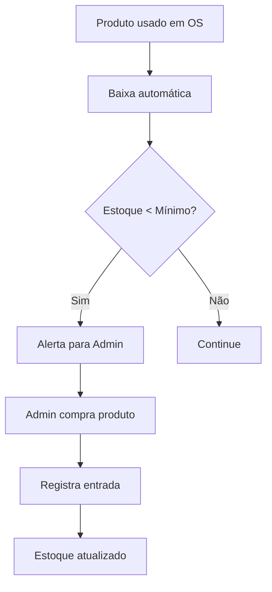
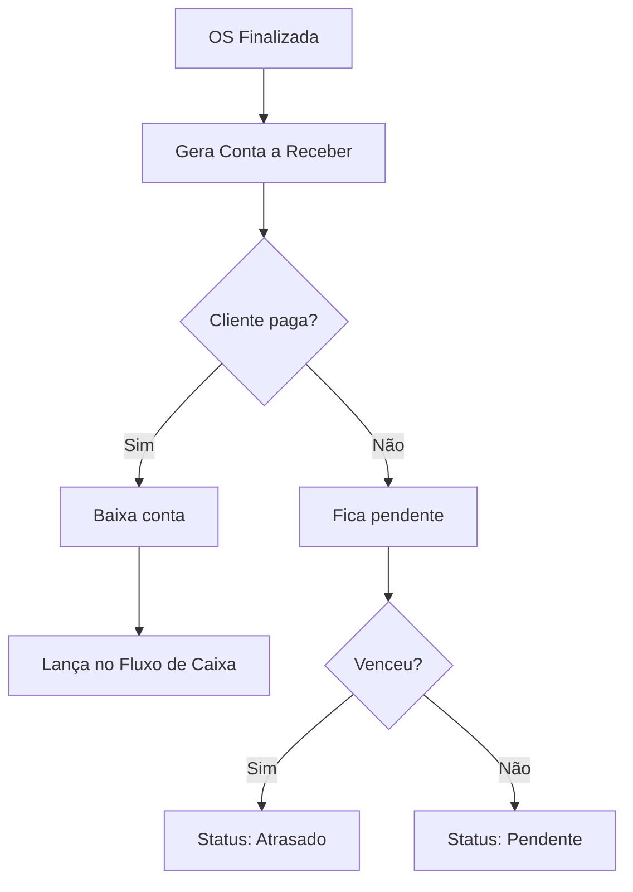

# 🏗️ AutoZen - Arquitetura Completa V3

## 📋 Visão Geral

**AutoZen** é um SaaS Multi-tenant Enterprise para gestão completa de negócios automotivos:

- ✅ Estética Automotiva
- ✅ Lava Jato
- ✅ Detailing Premium
- ✅ Polimento Técnico
- ✅ Vitrificação
- ✅ Higienização Interna
- ✅ Envelopamento
- ✅ Centros Automotivos
- ✅ Serviços para Carros e Motos

**Arquitetura:** Preparada para **milhares de empresas simultâneas**

---

## 👥 Níveis de Acesso

### 🔴 SUPER ADMIN (Plataforma)

**Controle Total da Plataforma**

```typescript
permissions: {
  empresas: ["create", "read", "update", "delete", "block", "suspend"],
  usuarios: ["manage_all"],
  metricas: ["view_global"],
  financeiro: ["view_all_transactions"],
  configuracoes: ["platform_config"],
  testes: ["activate_trials"],
}
```

**Pode:**
- Gerenciar todas as empresas
- Visualizar métricas globais
- Bloquear/suspender empresas
- Ativar períodos de teste
- Configurações de plataforma
- Suporte técnico avançado

---

### 🟠 ADMINISTRADOR (Empresa)

**Controle Total da Empresa**

```typescript
permissions: {
  funcionarios: ["all"],
  financeiro: ["all"],
  estoque: ["all"],
  clientes: ["all"],
  veiculos: ["all"],
  agenda: ["all"],
  os: ["all"],
  relatorios: ["all"],
  configuracoes: ["empresa"],
}
```

**Pode:**
- Tudo dentro da empresa
- Gerenciar funcionários
- Acesso financeiro completo
- Configurações da empresa
- Relatórios completos

---

### 🟡 GERENTE

**Permissões Intermediárias**

```typescript
permissions: {
  atendimentos: ["manage"],
  equipe: ["manage"],
  financeiro: ["view_limited"],
  servicos: ["approve"],
  relatorios: ["view_operational"],
}
```

**Pode:**
- Gerenciar atendimentos
- Gerenciar equipe
- Visualizar financeiro limitado
- Aprovar serviços
- Relatórios operacionais

---

### 🟢 ATENDENTE

**Operações de Front-desk**

```typescript
permissions: {
  clientes: ["create", "read", "update"],
  veiculos: ["create", "read"],
  os: ["create", "read"],
  agenda: ["create", "read", "update"],
  historico: ["read"],
}
```

**Pode:**
- Cadastrar clientes
- Abrir OS
- Agendar serviços
- Consultar histórico

---

### 🔵 OPERADOR

**Execução de Serviços**

```typescript
permissions: {
  agenda: ["read"],
  os: ["update_status", "register_execution"],
  servicos: ["execute"],
}
```

**Pode:**
- Visualizar agenda
- Atualizar status de OS
- Registrar execução de serviços

---

## 🗺️ Estrutura de Rotas Completa

```typescript
// Rotas Públicas
/auth
  /login              // Login
  /register           // Cadastro empresa
  /forgot-password    // Recuperar senha
  /reset-password     // Redefinir senha

// Rotas Protegidas
/app
  /dashboard          // Dashboard principal
  
  /clientes           // Lista de clientes
    /novo             // Novo cliente
    /[id]             // Detalhes do cliente
    /[id]/editar      // Editar cliente
  
  /veiculos           // Lista de veículos
    /novo             // Novo veículo
    /[id]             // Detalhes do veículo
    /[id]/editar      // Editar veículo
  
  /agendamentos       // Agenda
    /novo             // Novo agendamento
    /[id]             // Detalhes agendamento
    /calendario       // Visão calendário
    /timeline         // Visão timeline
  
  /ordens-servico     // Ordens de Serviço
    /nova             // Nova OS
    /[id]             // Detalhes OS
    /[id]/editar      // Editar OS
  
  /servicos           // Catálogo de serviços
    /novo             // Novo serviço
    /[id]             // Detalhes serviço
    /categorias       // Categorias
  
  /estoque            // Gestão de estoque
    /produtos         // Lista de produtos
      /novo           // Novo produto
      /[id]           // Detalhes produto
    /categorias       // Categorias
    /fornecedores     // Fornecedores
    /movimentacoes    // Movimentações
    /alertas          // Alertas estoque mínimo
  
  /financeiro         // Financeiro
    /receber          // Contas a receber
      /nova           // Nova conta
      /[id]           // Detalhes
    /pagar            // Contas a pagar
      /nova           // Nova conta
      /[id]           // Detalhes
    /fluxo-caixa      // Fluxo de caixa
    /dre              // DRE
  
  /equipe             // Gestão de equipe
    /funcionarios     // Lista
      /novo           // Novo funcionário
      /[id]           // Detalhes
    /permissoes       // Permissões
  
  /relatorios         // Relatórios
    /financeiro       // Relatórios financeiros
    /operacional      // Relatórios operacionais
    /clientes         // Relatórios clientes
    /servicos         // Relatórios serviços
  
  /configuracoes      // Configurações
    /empresa          // Dados da empresa
    /assinatura       // Plano e pagamento
    /integracao       // Integrações
    /notificacoes     // Configurar notificações
    /usuarios         // Usuários

// Rotas Super Admin
/superadmin
  /dashboard          // Dashboard global
  /empresas           // Gerenciar empresas
  /metricas           // Métricas globais
  /suporte            // Suporte
```

---

## 📊 Dashboard Principal

### KPIs Principais

```typescript
interface DashboardKPIs {
  faturamentoDia: {
    valor: number;
    variacao: number; // %
    meta: number;
  };
  
  faturamentoMes: {
    valor: number;
    variacao: number;
    meta: number;
    projecao: number;
  };
  
  osAbertas: {
    total: number;
    emAndamento: number;
    aguardando: number;
  };
  
  veiculosAtendimento: {
    total: number;
    porStatus: Record<string, number>;
  };
  
  clientesAtivos: {
    total: number;
    novos30dias: number;
    inativos: number;
  };
  
  ticketMedio: {
    valor: number;
    variacao: number;
    historico: Array<{ mes: string; valor: number }>;
  };
}
```

### Widgets do Dashboard

1. **Receita Mensal** (Gráfico de linha)
2. **Serviços Mais Vendidos** (Gráfico de barras)
3. **Fluxo de Caixa** (Gráfico de área)
4. **Agenda Semanal** (Timeline)
5. **OS por Status** (Pizza)
6. **Próximos Agendamentos** (Lista)
7. **Alertas** (Cards)
8. **Metas vs Realizado** (Barras horizontais)

---

## 👥 Módulo: CLIENTES

### Cadastro Completo

```typescript
interface Cliente {
  // Dados Pessoais
  id: string;
  tipo: "PF" | "PJ";
  nome: string;
  cpf?: string;
  cnpj?: string;
  dataNascimento?: Date;
  
  // Contato
  email: string;
  telefone: string;
  whatsapp: string;
  
  // Endereço
  endereco: {
    cep: string;
    logradouro: string;
    numero: string;
    complemento?: string;
    bairro: string;
    cidade: string;
    estado: string;
  };
  
  // Observações
  observacoes?: string;
  tags?: string[];
  
  // Metadata
  tenantId: string;
  createdAt: Date;
  updatedAt: Date;
  ativo: boolean;
}
```

### Tela: Perfil do Cliente

**Seções:**

1. **Header**
   - Nome do cliente
   - Status (Ativo/Inativo)
   - Tags
   - Botões de ação (Editar, Nova OS, Novo Veículo)

2. **Dados Cadastrais**
   - Informações pessoais
   - Contato
   - Endereço

3. **Veículos Vinculados**
   - Lista de veículos
   - Ações rápidas

4. **Histórico Financeiro**
   - Total gasto
   - Contas em aberto
   - Últimos pagamentos

5. **Histórico de Serviços**
   - Últimas OS
   - Serviços mais realizados
   - Timeline de atendimentos

6. **Agendamentos**
   - Próximos agendamentos
   - Histórico de agendamentos

---

## 🚗 Módulo: VEÍCULOS

### Cadastro Completo

```typescript
interface Veiculo {
  id: string;
  tenantId: string;
  
  // Cliente
  clienteId: string;
  
  // Dados do Veículo
  placa: string;
  marca: string;
  modelo: string;
  ano: number;
  cor: string;
  km: number;
  chassi?: string;
  combustivel: "Gasolina" | "Etanol" | "Diesel" | "GNV" | "Flex" | "Eletrico" | "Hibrido";
  
  // Uploads
  fotos: Array<{
    url: string;
    tipo: "externa" | "interna" | "documento";
    uploadedAt: Date;
  }>;
  
  documentos: Array<{
    url: string;
    tipo: string;
    nome: string;
    uploadedAt: Date;
  }>;
  
  // Observações
  observacoes?: string;
  
  // Metadata
  createdAt: Date;
  updatedAt: Date;
  ativo: boolean;
}
```

### Tela: Perfil do Veículo

**Seções:**

1. **Header**
   - Placa + Modelo
   - Foto principal
   - Botões (Nova OS, Novo Agendamento)

2. **Galeria de Fotos**
   - Fotos do veículo
   - Upload de novas fotos

3. **Informações**
   - Dados completos do veículo
   - Proprietário (link para cliente)

4. **Histórico de Serviços**
   - Todas as OS
   - Serviços realizados
   - Peças trocadas

5. **Histórico de Gastos**
   - Total investido
   - Gastos por mês
   - Gráfico de evolução

6. **Documentos**
   - CRLV, nota fiscal, etc.
   - Upload de documentos

---

## 📅 Módulo: AGENDAMENTOS

### Visualizações

#### 1. Calendário (Visão Mensal)
```typescript
interface AgendaCalendario {
  mes: number;
  ano: number;
  dias: Array<{
    dia: number;
    agendamentos: AgendamentoResumo[];
    disponibilidade: "livre" | "parcial" | "lotado";
  }>;
}
```

#### 2. Timeline (Visão Diária)
```typescript
interface AgendaTimeline {
  data: Date;
  horarios: Array<{
    hora: string; // "08:00"
    duracao: number; // minutos
    agendamento?: Agendamento;
    disponivel: boolean;
  }>;
}
```

#### 3. Semana (Visão Semanal)
```typescript
interface AgendaSemana {
  semana: number;
  dias: Array<{
    data: Date;
    agendamentos: AgendamentoResumo[];
  }>;
}
```

### Status de Agendamento

```typescript
type AgendamentoStatus = 
  | "agendado"      // Azul
  | "confirmado"    // Verde
  | "em_atendimento" // Amarelo
  | "finalizado"    // Sucesso
  | "cancelado";    // Vermelho
```

### Fluxo de Agendamento

1. **Selecionar Data/Hora**
2. **Escolher Cliente** (ou criar novo)
3. **Escolher Veículo** (ou vincular novo)
4. **Selecionar Serviços**
5. **Definir Responsável**
6. **Adicionar Observações**
7. **Confirmar** → Envia notificação WhatsApp

---

## 📋 Módulo: ORDENS DE SERVIÇO

### Estrutura Completa

```typescript
interface OrdemServico {
  id: string;
  numero: string; // "OS-2024-00123"
  tenantId: string;
  
  // Relacionamentos
  clienteId: string;
  veiculoId: string;
  funcionarioId: string; // Responsável
  
  // Datas
  dataAbertura: Date;
  dataInicio?: Date;
  dataFinalizacao?: Date;
  dataEntrega?: Date;
  
  // Status
  status: OSStatus;
  
  // Serviços
  servicos: Array<{
    servicoId: string;
    quantidade: number;
    valorUnitario: number;
    desconto: number;
    total: number;
    executadoPor?: string; // funcionarioId
    observacoes?: string;
  }>;
  
  // Produtos
  produtos: Array<{
    produtoId: string;
    quantidade: number;
    valorUnitario: number;
    total: number;
  }>;
  
  // Checklist
  checklist: Array<{
    item: string;
    concluido: boolean;
    observacao?: string;
  }>;
  
  // Fotos
  fotos: {
    antes: string[];
    durante: string[];
    depois: string[];
  };
  
  // Valores
  subtotal: number;
  desconto: number;
  total: number;
  valorPago: number;
  troco: number;
  
  // Pagamento
  formaPagamento: "dinheiro" | "pix" | "cartao_credito" | "cartao_debito" | "boleto";
  
  // Assinatura
  assinaturaCliente?: string; // base64
  assinaturaData?: Date;
  
  // Observações
  observacoes?: string;
  observacoesInternas?: string;
  
  // Metadata
  createdBy: string;
  updatedBy: string;
  createdAt: Date;
  updatedAt: Date;
}

type OSStatus = 
  | "aberta"           // Branco
  | "aguardando"       // Amarelo
  | "em_execucao"      // Azul
  | "finalizada"       // Verde
  | "entregue"         // Sucesso
  | "cancelada";       // Vermelho
```

### Fluxo de OS



### Tela: Criar OS

**Passos:**

1. **Selecionar Cliente + Veículo**
2. **Adicionar Serviços**
   - Buscar serviço
   - Quantidade
   - Valor
   - Desconto
3. **Adicionar Produtos** (opcional)
4. **Definir Checklist**
   - Itens pré-configurados
   - Adicionar custom
5. **Upload de Fotos (Antes)**
6. **Observações**
7. **Definir Responsável**
8. **Confirmar e Abrir**

### Tela: Detalhes OS

**Seções:**

1. **Header**
   - Número OS
   - Status badge
   - Ações (Editar, Imprimir, Finalizar)

2. **Informações**
   - Cliente e Veículo
   - Responsável
   - Datas

3. **Serviços e Produtos**
   - Tabela com valores
   - Subtotal

4. **Checklist**
   - Marcar itens concluídos
   - Adicionar observações

5. **Galeria de Fotos**
   - Antes / Durante / Depois
   - Upload durante execução

6. **Valores**
   - Subtotal
   - Desconto
   - Total
   - Forma de pagamento

7. **Timeline**
   - Histórico de mudanças de status
   - Quem fez e quando

8. **Assinatura**
   - Pad de assinatura digital
   - Salvar e gerar PDF

---

## 🛠️ Módulo: SERVIÇOS

### Estrutura

```typescript
interface Servico {
  id: string;
  tenantId: string;
  
  // Dados
  nome: string;
  descricao?: string;
  categoriaId: string;
  
  // Valores
  valor: number;
  custoMedio?: number;
  
  // Execução
  tempoMedio: number; // minutos
  
  // Comissão
  comissaoTipo: "percentual" | "fixo";
  comissaoValor: number;
  
  // Materiais
  materiais?: Array<{
    produtoId: string;
    quantidade: number;
  }>;
  
  // Metadata
  ativo: boolean;
  createdAt: Date;
  updatedAt: Date;
}

interface CategoriaServico {
  id: string;
  tenantId: string;
  nome: string;
  cor: string;
  icone?: string;
  ordem: number;
}
```

### Categorias Padrão

- 🚿 Lavagem
- ✨ Polimento
- 💎 Vitrificação
- 🧹 Higienização
- 🎨 Envelopamento
- 🔧 Mecânica Rápida
- 📦 Outros

---

## 📦 Módulo: ESTOQUE

### Produtos

```typescript
interface Produto {
  id: string;
  tenantId: string;
  
  // Dados
  nome: string;
  descricao?: string;
  codigo?: string;
  codigoBarras?: string;
  categoriaId: string;
  
  // Fornecedor
  fornecedorId?: string;
  
  // Estoque
  quantidadeAtual: number;
  quantidadeMinima: number;
  quantidadeMaxima?: number;
  unidade: "UN" | "L" | "ML" | "KG" | "G" | "M" | "CM";
  
  // Valores
  custoUnitario: number;
  precoVenda: number;
  margemLucro: number; // %
  
  // Lote
  lote?: string;
  dataValidade?: Date;
  
  // Localização
  localizacao?: string; // "Prateleira A-1"
  
  // Metadata
  ativo: boolean;
  createdAt: Date;
  updatedAt: Date;
}
```

### Movimentações

```typescript
interface MovimentacaoEstoque {
  id: string;
  tenantId: string;
  produtoId: string;
  
  tipo: "entrada" | "saida" | "ajuste" | "perda" | "devolucao";
  quantidade: number;
  
  // Relacionamentos
  ordemServicoId?: string;
  fornecedorId?: string;
  
  // Valores
  custoUnitario?: number;
  custoTotal?: number;
  
  // Motivo
  motivo: string;
  observacoes?: string;
  
  // Metadata
  realizadoPor: string; // userId
  createdAt: Date;
}
```

### Alertas de Estoque

- 🔴 **Crítico**: Quantidade abaixo do mínimo
- 🟡 **Atenção**: Próximo do mínimo (80%)
- ⏰ **Validade**: Produtos vencendo em 30 dias
- 📦 **Sem Movimento**: Produtos parados há 90 dias

---

## 💰 Módulo: FINANCEIRO

### Contas a Receber

```typescript
interface ContaReceber {
  id: string;
  tenantId: string;
  
  // Relacionamentos
  clienteId: string;
  ordemServicoId?: string;
  
  // Dados
  descricao: string;
  valor: number;
  valorRecebido: number;
  
  // Datas
  dataEmissao: Date;
  dataVencimento: Date;
  dataPagamento?: Date;
  
  // Status
  status: "pendente" | "pago" | "atrasado" | "cancelado";
  
  // Pagamento
  formaPagamento?: string;
  
  // Metadata
  createdBy: string;
  createdAt: Date;
  updatedAt: Date;
}
```

### Contas a Pagar

```typescript
interface ContaPagar {
  id: string;
  tenantId: string;
  
  // Relacionamentos
  fornecedorId?: string;
  categoriaId: string;
  
  // Dados
  descricao: string;
  valor: number;
  valorPago: number;
  
  // Datas
  dataEmissao: Date;
  dataVencimento: Date;
  dataPagamento?: Date;
  
  // Status
  status: "pendente" | "pago" | "atrasado" | "cancelado";
  
  // Pagamento
  formaPagamento?: string;
  
  // Anexos
  notaFiscal?: string;
  comprovante?: string;
  
  // Metadata
  createdBy: string;
  createdAt: Date;
  updatedAt: Date;
}
```

### Fluxo de Caixa

```typescript
interface FluxoCaixa {
  data: Date;
  
  entradas: {
    total: number;
    detalhes: Array<{
      origem: string;
      valor: number;
      categoria: string;
    }>;
  };
  
  saidas: {
    total: number;
    detalhes: Array<{
      destino: string;
      valor: number;
      categoria: string;
    }>;
  };
  
  saldo: number;
  saldoAcumulado: number;
}
```

### DRE Simplificada

```typescript
interface DRE {
  periodo: {
    inicio: Date;
    fim: Date;
  };
  
  receitas: {
    servicos: number;
    produtos: number;
    outras: number;
    total: number;
  };
  
  custos: {
    materiais: number;
    maoDeObra: number;
    total: number;
  };
  
  lucroBruto: number;
  
  despesas: {
    fixas: number;
    variaveis: number;
    total: number;
  };
  
  lucroLiquido: number;
  margemLiquida: number; // %
}
```

---

## 📊 Módulo: RELATÓRIOS

### Tipos de Relatórios

#### 1. Financeiros
- **Receitas por Período**
- **Despesas por Categoria**
- **Fluxo de Caixa Projetado**
- **DRE Mensal/Anual**
- **Inadimplência**
- **Comissões**

#### 2. Operacionais
- **OS por Status**
- **Serviços Mais Realizados**
- **Tempo Médio de Atendimento**
- **Taxa de Conversão Agenda → OS**
- **Produtividade por Funcionário**

#### 3. Clientes
- **Novos Clientes**
- **Clientes Inativos**
- **Ticket Médio por Cliente**
- **Frequência de Retorno**
- **Clientes por Região**

#### 4. Veículos
- **Marcas Mais Atendidas**
- **Serviços por Tipo de Veículo**
- **Ticket Médio por Marca**

#### 5. Estoque
- **Produtos Mais Utilizados**
- **Giro de Estoque**
- **Produtos Parados**
- **Valor Total do Estoque**

### Exportação

```typescript
interface RelatorioExport {
  tipo: "PDF" | "Excel" | "CSV";
  dados: any;
  filtros: Record<string, any>;
  geradoEm: Date;
  geradoPor: string;
}
```

**Formatos:**
- 📄 **PDF** - Visualização e impressão
- 📊 **Excel** - Análise avançada
- 📋 **CSV** - Importação em outros sistemas

---

## 🔔 Central de Notificações

### Tipos de Notificações

```typescript
interface Notificacao {
  id: string;
  tenantId: string;
  usuarioId: string;
  
  tipo: NotificacaoTipo;
  titulo: string;
  mensagem: string;
  
  // Relacionamento
  referenciaId?: string;
  referenciaType?: "os" | "agendamento" | "conta" | "produto";
  
  // Status
  lida: boolean;
  lida_em?: Date;
  
  // Metadata
  createdAt: Date;
}

type NotificacaoTipo = 
  | "nova_os"
  | "os_finalizada"
  | "novo_agendamento"
  | "agendamento_confirmado"
  | "agendamento_cancelado"
  | "baixo_estoque"
  | "produto_vencendo"
  | "pagamento_recebido"
  | "conta_vencendo"
  | "conta_vencida"
  | "novo_cliente"
  | "meta_atingida";
```

### Canais de Notificação

1. **In-App** (sino no header)
2. **Email** (configurável)
3. **WhatsApp** (integrações futuras)
4. **Push** (PWA futuro)

---

## ⚙️ Módulo: CONFIGURAÇÕES

### 1. Dados da Empresa

```typescript
interface EmpresaConfig {
  // Identificação
  razaoSocial: string;
  nomeFantasia: string;
  cnpj: string;
  inscricaoEstadual?: string;
  
  // Logo
  logo?: string;
  logoUrl?: string;
  
  // Contato
  email: string;
  telefone: string;
  whatsapp: string;
  website?: string;
  
  // Endereço
  endereco: Endereco;
  
  // Horário de Funcionamento
  horarioFuncionamento: Array<{
    diaSemana: number; // 0-6
    abertura: string; // "08:00"
    fechamento: string; // "18:00"
    fechado: boolean;
  }>;
  
  // Configurações de Atendimento
  tempoMedioPorVaga: number; // minutos
  vagasSimultaneas: number;
  intervaloAgendamento: number; // minutos
}
```

### 2. Assinatura e Pagamento

```typescript
interface AssinaturaConfig {
  // Plano
  plano: "premium"; // Único plano
  status: "ativa" | "trial" | "suspensa" | "cancelada";
  
  // Datas
  dataInicio: Date;
  dataRenovacao: Date;
  dataTerminoTrial?: Date;
  dataCancelamento?: Date;
  
  // Pagamento
  formaPagamento: "cartao" | "boleto" | "pix";
  valorMensal: number;
  
  // Histórico
  pagamentos: Array<{
    data: Date;
    valor: number;
    status: "pago" | "pendente" | "falhou";
    comprovante?: string;
  }>;
  
  // Limites (todos ilimitados no plano premium)
  limites: {
    usuarios: number; // ilimitado
    clientes: number; // ilimitado
    veiculos: number; // ilimitado
    os: number; // ilimitado
    storage: number; // GB
  };
}
```

### 3. Integrações

```typescript
interface Integracoes {
  // WhatsApp (Evolution API)
  whatsapp: {
    ativo: boolean;
    apiKey?: string;
    instance?: string;
    notificarClientes: boolean;
    notificarEquipe: boolean;
  };
  
  // Pagamentos
  pix: {
    ativo: boolean;
    chave: string;
    qrCodeAutomatico: boolean;
  };
  
  stripe: {
    ativo: boolean;
    publicKey?: string;
    secretKey?: string;
  };
  
  mercadoPago: {
    ativo: boolean;
    accessToken?: string;
  };
  
  // NFE
  nfe: {
    ativo: boolean;
    certificado?: string;
    ambiente: "producao" | "homologacao";
  };
  
  // Outros
  googleCalendar: {
    ativo: boolean;
    sincronizarAgenda: boolean;
  };
  
  googleDrive: {
    ativo: boolean;
    backupAutomatico: boolean;
  };
}
```

### 4. Usuários e Permissões

```typescript
interface Usuario {
  id: string;
  tenantId: string;
  
  // Dados
  nome: string;
  email: string;
  telefone?: string;
  avatar?: string;
  
  // Acesso
  role: "admin" | "gerente" | "atendente" | "operador";
  permissoes: string[]; // granular
  
  // Status
  ativo: boolean;
  ultimoAcesso?: Date;
  
  // Metadata
  createdAt: Date;
  updatedAt: Date;
}
```

---

## 🏢 Multi-Tenant Architecture

### Isolamento de Dados

```typescript
// TODAS as tabelas têm:
interface BaseModel {
  tenantId: string; // UUID da empresa
  // ... outros campos
}

// Row Level Security (Supabase)
CREATE POLICY tenant_isolation ON table_name
  USING (tenant_id = current_setting('app.current_tenant')::uuid);
```

### Estrutura no Banco

```sql
-- Tabela de Tenants (Empresas)
CREATE TABLE tenants (
  id UUID PRIMARY KEY DEFAULT uuid_generate_v4(),
  razao_social TEXT NOT NULL,
  nome_fantasia TEXT NOT NULL,
  cnpj TEXT UNIQUE NOT NULL,
  status TEXT NOT NULL DEFAULT 'trial',
  created_at TIMESTAMP DEFAULT NOW(),
  updated_at TIMESTAMP DEFAULT NOW()
);

-- Todas as outras tabelas
CREATE TABLE clientes (
  id UUID PRIMARY KEY DEFAULT uuid_generate_v4(),
  tenant_id UUID NOT NULL REFERENCES tenants(id),
  nome TEXT NOT NULL,
  -- ... outros campos
  CONSTRAINT unique_cliente_per_tenant UNIQUE (tenant_id, cpf)
);

-- Índices obrigatórios
CREATE INDEX idx_clientes_tenant ON clientes(tenant_id);
CREATE INDEX idx_veiculos_tenant ON veiculos(tenant_id);
-- ... para todas tabelas
```

### Cada Empresa Possui

✅ **Usuários próprios**  
✅ **Clientes próprios**  
✅ **Veículos próprios**  
✅ **OS próprias**  
✅ **Estoque próprio**  
✅ **Financeiro próprio**  
✅ **Configurações próprias**  

**Isolamento Obrigatório**: Nenhum dado é compartilhado entre empresas

---

## 🔌 Integrações Futuras

### 1. WhatsApp (Evolution API)
- Notificações automáticas
- Confirmação de agendamentos
- Avisos de OS pronta
- Lembretes de pagamento


### 2. Pagamentos
- **PIX** - QR Code automático
- **Stripe** - Cartões e assinaturas
- **Mercado Pago** - Gateway brasileiro
- **Asaas** - Cobranças recorrentes

### 3. Nota Fiscal
- **NFe** - Nota Fiscal Eletrônica
- **NFSe** - Nota Fiscal de Serviço
- Emissão automática ao finalizar OS

### 4. Calendário
- **Google Calendar** - Sincronização bidirecional
- **Outlook Calendar** - Sincronização

### 5. Armazenamento
- **Google Drive** - Backup automático
- **Dropbox** - Backup de arquivos

### 6. IA e Automação
- **OpenAI** - Geração de descrições
- **ChatGPT** - Atendimento automatizado
- **Análise preditiva** - Manutenção preventiva

### 7. Webhooks
```typescript
interface Webhook {
  evento: string;
  url: string;
  ativo: boolean;
  secret: string;
  
  eventos: [
    "os.criada",
    "os.finalizada",
    "pagamento.recebido",
    "agendamento.criado",
    "cliente.cadastrado",
  ];
}
```

---

## 💳 Modelo de Assinatura

### Plano Único: AutoZen Premium

**Valor:** R$ 97,00/mês

**Incluso:**

✅ **Usuários Ilimitados**  
✅ **Clientes Ilimitados**  
✅ **Veículos Ilimitados**  
✅ **OS Ilimitadas**  
✅ **Agendamentos Ilimitados**  

✅ **Todos os Módulos:**
- Dashboard Completo
- Gestão de Clientes
- Gestão de Veículos
- Agenda Inteligente
- Ordens de Serviço
- Catálogo de Serviços
- Controle de Estoque
- Financeiro Completo
- Relatórios Avançados
- Central de Notificações

✅ **Recursos Premium:**
- Backup Automático
- Atualizações Contínuas
- Suporte Técnico
- Multi-dispositivos
- App Mobile (futuro)
- Integrações

✅ **Storage:** 50GB por empresa

### Período de Teste

- **14 dias grátis**
- Acesso completo
- Sem cartão de crédito
- Migração automática após trial

### Suspensão por Inadimplência

```typescript
interface SuspensaoConfig {
  diasAposVencimento: 7;
  
  acoes: {
    dia1: "enviar_email_cobranca",
    dia3: "enviar_whatsapp",
    dia5: "bloquear_criacao_novos",
    dia7: "suspender_acesso",
    dia30: "remover_dados", // após aviso
  };
}
```

---

## 📱 Fluxos Principais

### Fluxo 1: Novo Cliente e Primeira OS



### Fluxo 2: Cliente Recorrente



### Fluxo 3: Gestão de Estoque



### Fluxo 4: Financeiro



---

## 🎯 Métricas de Sucesso

### Para o Negócio (Tenant)

```typescript
interface MetricasEmpresa {
  // Financeiro
  faturamentoMensal: number;
  lucroMensal: number;
  ticketMedio: number;
  inadimplencia: number; // %
  
  // Operacional
  osRealizadas: number;
  taxaOcupacao: number; // %
  tempoMedioAtendimento: number; // minutos
  
  // Clientes
  clientesAtivos: number;
  clientesNovos: number;
  taxaRetencao: number; // %
  nps: number; // Net Promoter Score
  
  // Equipe
  produtividadePorFuncionario: number;
  comissoesPagas: number;
}
```

### Para a Plataforma (SaaS)

```typescript
interface MetricasPlataforma {
  // Assinaturas
  mrr: number; // Monthly Recurring Revenue
  arr: number; // Annual Recurring Revenue
  churn: number; // % cancelamentos
  
  // Empresas
  empresasAtivas: number;
  empresasNovas: number;
  empresasSuspensas: number;
  
  // Uso
  osGeradas: number;
  usuariosAtivos: number;
  ticketsSuporteAbertos: number;
}
```

---

## 🔐 Segurança

### Autenticação

- **JWT Tokens** (Supabase Auth)
- **Refresh Tokens**
- **MFA** (2FA opcional)
- **Password Reset** seguro

### Autorização

- **RBAC** (Role-Based Access Control)
- **Row Level Security** (RLS)
- **Permissões granulares**

### Dados

- **Encriptação em trânsito** (HTTPS)
- **Encriptação em repouso** (PostgreSQL)
- **Backup diário** automático
- **LGPD compliance**

---

## 📊 Banco de Dados - Principais Tabelas

```sql
-- Core
tenants
users
permissions

-- CRM
clientes
veiculos

-- Operacional
agendamentos
ordens_servico
os_servicos
os_produtos
servicos
categorias_servicos

-- Estoque
produtos
categorias_produtos
fornecedores
movimentacoes_estoque

-- Financeiro
contas_receber
contas_pagar
fluxo_caixa
categorias_financeiras

-- Sistema
notificacoes
configuracoes
logs_auditoria
```

---

## 🚀 Roadmap de Desenvolvimento

### Fase 1: MVP ✅ (Completa)
- Auth Screen
- Design System V2

### Fase 2: Core (Q1 2025)
- [ ] Autenticação real
- [ ] CRUD Clientes
- [ ] CRUD Veículos
- [ ] Multi-tenant setup

### Fase 3: Operacional (Q2 2025)
- [ ] Agendamentos
- [ ] Ordens de Serviço
- [ ] Catálogo de Serviços
- [ ] Dashboard dinâmico

### Fase 4: Financeiro (Q2 2025)
- [ ] Contas a Receber/Pagar
- [ ] Fluxo de Caixa
- [ ] DRE
- [ ] Relatórios

### Fase 5: Estoque (Q3 2025)
- [ ] Gestão de Produtos
- [ ] Movimentações
- [ ] Alertas

### Fase 6: Integrações (Q3 2025)
- [ ] WhatsApp (Evolution API)
- [ ] PIX
- [ ] Stripe/MercadoPago

### Fase 7: Mobile & PWA (Q4 2025)
- [ ] Progressive Web App
- [ ] App React Native

---

## 🎉 Resultado Final

Um **SaaS Multi-tenant Enterprise** completo e escalável:

✅ **Arquitetura profissional** preparada para milhares de empresas  
✅ **5 níveis de acesso** com permissões granulares  
✅ **12 módulos completos** documentados  
✅ **Multi-tenant real** com isolamento total  
✅ **Modelo de assinatura único** e lucrativo  
✅ **Integrações planejadas** para futuro  
✅ **Segurança enterprise** (LGPD, RLS, JWT)  
✅ **Pronto para escalar** do MVP ao IPO  

---

**AutoZen V3** - Arquitetura Enterprise Completa 🚀

_Do lava-jato de bairro ao centro automotivo premium_

